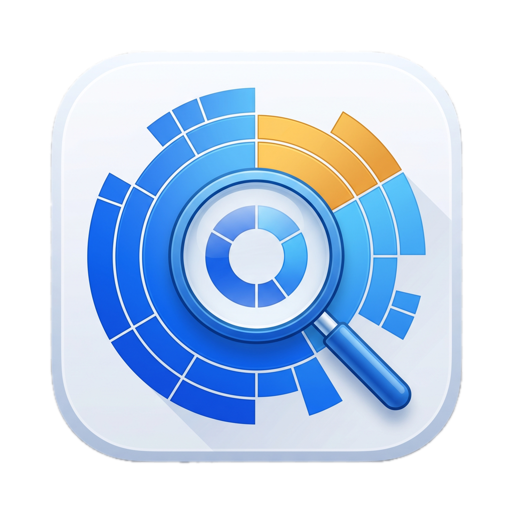

<p align="center">
  
</p>

<h1 align="center">Diskovery</h1>

<p align="center">
  Application macOS native (SwiftUI) pour explorer et libérer votre espace disque —
  un <strong>hub d'outils</strong> extensible.
</p>

<p align="center">
  
  
  
</p>

---

## Fonctionnalités

Quatre outils, accessibles depuis une barre latérale :

| Outil | Ce qu'il fait |
|-------|---------------|
| **Espace disque** | Navigateur façon DaisyDisk : choisissez un dossier, voyez les plus gros fichiers/sous-dossiers, double-cliquez pour plonger dedans (fil d'Ariane, retour, cache pour une navigation instantanée). |
| **node_modules** | Trouve récursivement tous les `node_modules`, met en avant ceux dépassant un seuil d'ancienneté configurable, et les supprime (un par un ou tous les anciens d'un coup). |
| **Gros fichiers** | Liste les fichiers les plus volumineux sous un dossier (top-N). |
| **Caches de build** | Repère les caches/artefacts de build par écosystème — JavaScript (`node_modules`, `.next`, `dist`, `build`), Rust (`target`), Python (`__pycache__`, `.venv`), JVM (`.gradle`), PHP (`vendor`), Xcode (`DerivedData`). |

Transverse à tous les outils :

- **Scans parallélisés** sur tous les cœurs, avec **affichage progressif** et barre de progression.
- **Suppression** vers la Corbeille (réversible) ou définitive, avec sélection multiple et confirmation.
- **État conservé** en changeant d'outil — on ne repart jamais de zéro.

## Installation

Téléchargez `Diskovery.dmg` (depuis les [Releases](../../releases) ou le site),
ouvrez-le, puis glissez **Diskovery** dans **Applications**.

L'app est **signée Developer ID et notarisée par Apple** : elle s'ouvre sans
avertissement Gatekeeper.

## Prérequis

- macOS 14 (Sonoma) ou plus récent
- Pour compiler : Xcode 16+ / Swift 6 (la toolchain `swift` suffit)

## Développement

```bash
open Package.swift   # puis Cmd+R dans Xcode
```

ou en ligne de commande :

```bash
swift build
swift test            # 49 tests sur la logique cœur (DiskoveryCore)
```

## Construire le .dmg

```bash
./make-dmg.sh
```

Sans variables d'environnement, le bundle est signé en **ad-hoc** (dev local) et
le `.dmg` déclenche un avertissement Gatekeeper au premier lancement.

### Build signé Developer ID + notarisé (distribution)

Pour un `.dmg` qui s'ouvre **sans aucun avertissement** une fois téléchargé :

```bash
export DISKOVERY_SIGN_IDENTITY="Developer ID Application: VOTRE NOM (TEAMID)"
export DISKOVERY_NOTARY_PROFILE="diskovery"   # via `xcrun notarytool store-credentials`
./make-dmg.sh
```

Le script signe (Developer ID + hardened runtime + timestamp), **notarise** l'app
et le `.dmg` auprès d'Apple, **agrafe** les tickets, et compose une fenêtre
d'installation (fond, flèche, glisser-vers-Applications).

## Benchmark

```bash
swift run -c release DiskoveryBench ~/un/dossier
```

Compare les implémentations séquentielle et parallèle du scan, et mesure le coût
de la recherche de `node_modules`.

## Architecture

- **`DiskoveryCore`** — logique pure et testable, sans dépendance UI : parcours du
  système de fichiers, calcul des tailles (parallélisé + mis en cache), recherche
  de `node_modules`/caches, suppression (corbeille/définitive).
- **`Diskovery`** — l'app SwiftUI. Registre d'outils extensible : la barre latérale
  itère sur `ToolRegistry.all`, et chaque outil porte son propre view model dans le
  `SessionStore` (état persistant).

## Ajouter un outil

1. Créer une vue + son view model dans `Sources/Diskovery/Tools/`.
2. Ajouter son view model au `SessionStore`.
3. Enregistrer son `ToolDescriptor` dans `ToolRegistry.all`.

Rien d'autre à modifier — la barre latérale le détecte automatiquement.

## Licence

[MIT](LICENSE) © Louis de Caumont
